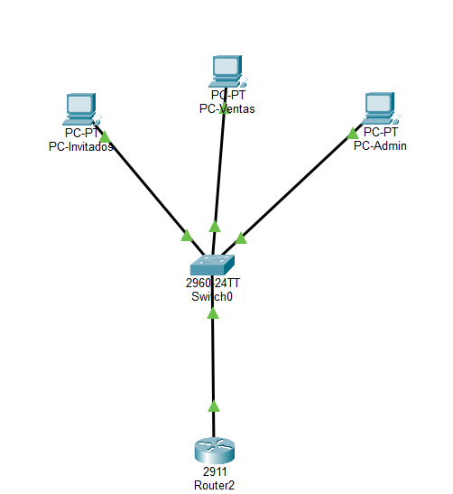

# 🌐 Laboratorio de Redes: Segmentación con VLANs

Este proyecto demuestra la implementación de una red empresarial básica utilizando **Cisco Packet Tracer**.

## 🚀 Tecnologías Utilizadas
* **Capa 2:** VLANs (ADMIN, VENTAS), Puertos de Acceso y Trunking (802.1Q).
* **Capa 3:** Router-on-a-Stick (Subinterfaces).
* **Hardware:** Router Cisco 2911, Switch 2960.

## 📸 Topología de la Red

## 📊 Tabla de Direccionamiento
| Dispositivo | Interfaz | Dirección IP | VLAN |
| :--- | :--- | :--- | :--- |
| Router | Gig0/0.10 | 192.168.10.1 | 10 |
| Router | Gig0/0.20 | 192.168.20.1 | 20 |
| PC-Admin | NIC | 192.168.10.10 | 10 |
| PC-Ventas | NIC | 192.168.20.10 | 20 |

## ✅ Pruebas Realizadas
- [x] Ping exitoso entre PCs de diferentes VLANs a través del Router.
- [x] Configuración de enlaces Trunk para transporte de múltiples etiquetas de VLAN.
